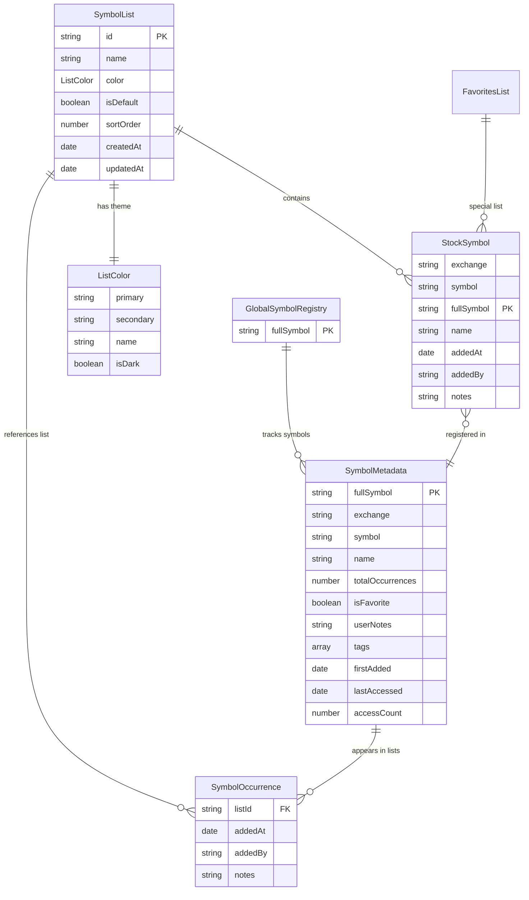
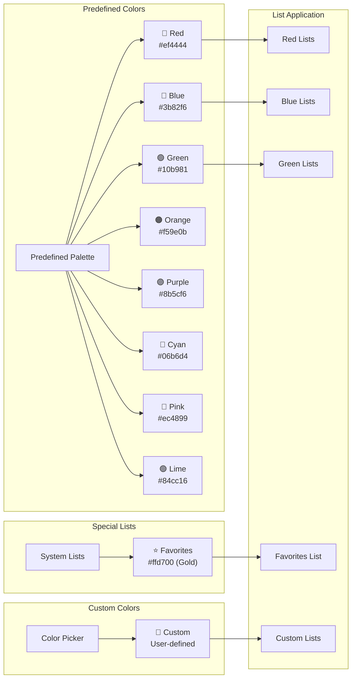
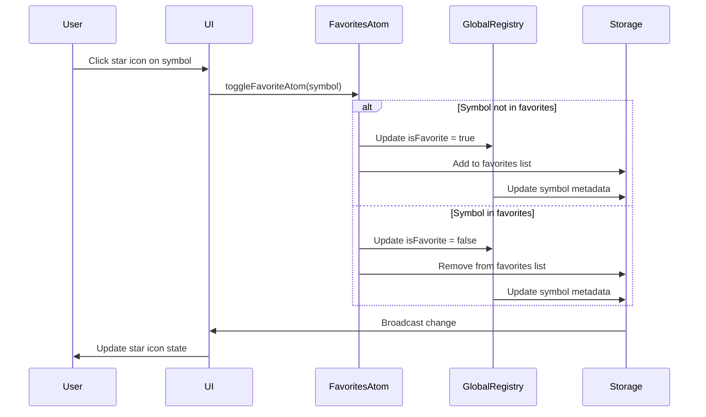
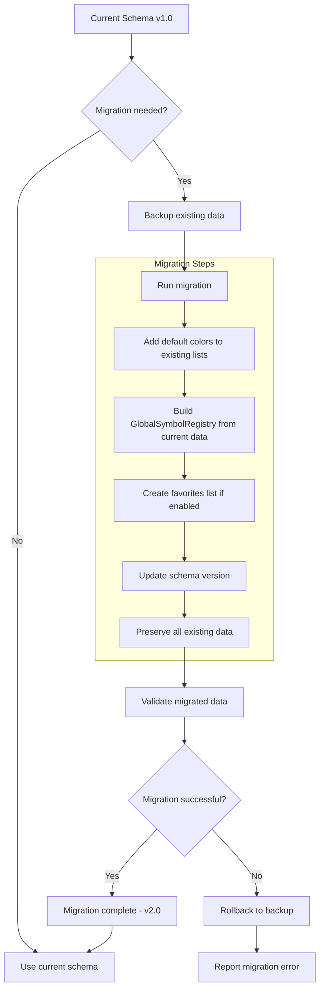

# Schema Diagram - TradingView Symbol Manager
## Current vs Enhanced Schema Design

---

## 🔄 **CURRENT SCHEMA (Implemented)**

```mermaid
graph TB
    subgraph "Chrome Extension Storage"
        CS[Chrome Storage Local]
        CS --> SL[symbolLists: SymbolList[]]
        CS --> CLI[currentListId: string | null]
        CS --> SET[settings: AppSettings]
    end

    subgraph "Current SymbolList Interface"
        SL --> SLI["{
            id: string
            name: string
            symbols: StockSymbol[]
            createdAt: Date
            updatedAt: Date
        }"]
    end

    subgraph "Current StockSymbol Interface"
        SLI --> SSI["{
            exchange: 'NSE' | 'BSE'
            symbol: string
            fullSymbol: string
            name?: string
            originalInput?: string
        }"]
    end

    subgraph "Current AppSettings Interface"
        SET --> ASI["{
            theme: 'dark' | 'light'
            defaultExchange: 'NSE' | 'BSE'
            autoOpenTradingView: boolean
            widgetPosition: { x: number, y: number }
        }"]
    end
```

---

## 🎨 **ENHANCED SCHEMA (Proposed)**

```mermaid
graph TB
    subgraph "Enhanced Chrome Extension Storage"
        ECS[Chrome Storage Local]
        ECS --> ESL[symbolLists: SymbolList[]]
        ECS --> CLI2[currentListId: string | null]
        ECS --> GSR[globalSymbolRegistry: GlobalSymbolRegistry]
        ECS --> SET2[settings: AppSettings]
        ECS --> LS[listSettings: ListSettings]
    end

    subgraph "Enhanced SymbolList Interface"
        ESL --> ESLI["{
            id: string
            name: string
            color: ListColor ✨ NEW
            symbols: StockSymbol[]
            createdAt: Date
            updatedAt: Date
            isDefault?: boolean ✨ NEW
            sortOrder?: number ✨ NEW
        }"]
    end

    subgraph "NEW: ListColor Interface"
        ESLI --> LCI["{
            primary: string (hex color)
            secondary: string (background)
            name: string (display name)
            isDark?: boolean
        }"]
    end

    subgraph "Enhanced StockSymbol Interface"
        ESLI --> ESSI["{
            exchange: 'NSE' | 'BSE'
            symbol: string
            fullSymbol: string
            name?: string
            originalInput?: string
            addedAt: Date ✨ NEW
            addedBy?: 'user'|'import'|'copy' ✨ NEW
            notes?: string ✨ NEW

            // Computed Fields:
            isFavorite?: boolean ✨ NEW
            otherLists?: string[] ✨ NEW
            totalOccurrences?: number ✨ NEW
        }"]
    end

    subgraph "NEW: GlobalSymbolRegistry"
        GSR --> GSRI["{
            [fullSymbol: string]: SymbolMetadata
        }"]

        GSRI --> SMI["{
            fullSymbol: string
            exchange: 'NSE' | 'BSE'
            symbol: string
            name?: string
            listOccurrences: SymbolOccurrence[]
            totalOccurrences: number
            isFavorite: boolean
            userNotes?: string
            tags?: string[]
            firstAdded: Date
            lastAccessed: Date
            accessCount: number
        }"]

        SMI --> SOI["{
            SymbolOccurrence:
            listId: string
            addedAt: Date
            addedBy: 'user'|'import'|'copy'
            notes?: string
        }"]
    end

    subgraph "Enhanced AppSettings"
        SET2 --> ASI2["{
            theme: 'dark' | 'light'
            defaultExchange: 'NSE' | 'BSE'
            autoOpenTradingView: boolean
            widgetPosition: { x: number, y: number }
        }"]
    end

    subgraph "NEW: ListSettings Interface"
        LS --> LSI["{
            defaultListColor: ListColor
            showCrossListIndicators: boolean
            autoCreateFavorites: boolean
            favoriteThreshold: number
        }"]
    end
```

---

## 🎯 **DATA RELATIONSHIPS DIAGRAM**



---

## 🔄 **DATA FLOW ARCHITECTURE**

```mermaid
flowchart TD
    subgraph "Input Sources"
        CSV[CSV File Upload]
        TXT[Text Input]
        UI[UI Actions]
    end

    subgraph "Processing Layer"
        CSV --> P1[parseCSV()]
        TXT --> P2[parseTextInput()]
        UI --> P3[User Actions]
    end

    subgraph "Jotai Atoms Layer"
        P1 --> JA[Jotai Atoms]
        P2 --> JA
        P3 --> JA

        JA --> SLA[symbolListsAtom]
        JA --> GSRA[globalSymbolRegistryAtom]
        JA --> CLA[currentListAtom]
        JA --> FA[favoritesListAtom]
        JA --> SOA[symbolOccurrencesAtom]
    end

    subgraph "Storage Layer"
        SLA --> CS[Chrome Storage API]
        GSRA --> CS
        CLA --> CS
        CS --> STO[Local Storage]
    end

    subgraph "Cross-Context Sync"
        CS --> SC[Storage Change Events]
        SC --> POP[Popup Context]
        SC --> CON[Content Script Context]
        SC --> BG[Background Context]
    end

    subgraph "UI Rendering"
        POP --> LC[List Components]
        POP --> SC1[Symbol Components]
        CON --> FW[Floating Widget]

        LC --> CLI[Color Indicators]
        SC1 --> SI[Star Icons]
        SC1 --> MLI[Multi-List Indicators]
        FW --> RTS[Real-time Sync]
    end
```

---

## 🌈 **COLOR SYSTEM DIAGRAM**



---

## ⭐ **FAVORITES SYSTEM FLOW**



---

## 🔄 **MULTI-LIST SYMBOL TRACKING**

```mermaid
graph TB
    subgraph "Symbol Addition Flow"
        ADD[Add Symbol to List]
        ADD --> CHECK{Symbol exists in registry?}

        CHECK -->|No| CREATE[Create new SymbolMetadata]
        CHECK -->|Yes| UPDATE[Update existing SymbolMetadata]

        CREATE --> ADDO[Add SymbolOccurrence]
        UPDATE --> ADDO

        ADDO --> INCR[Increment totalOccurrences]
        INCR --> STORE[Update Storage]
    end

    subgraph "Cross-List Indicator Computation"
        STORE --> COMP[Compute otherLists[]]
        COMP --> FILTER[Filter current list]
        FILTER --> DISPLAY[Display indicators]
    end

    subgraph "Example: Symbol in 3 Lists"
        EX[NSE:BHARATGEAR]
        EX --> L1[Red List: "Tech Stocks"]
        EX --> L2[Blue List: "Small Cap"]
        EX --> L3[⭐ Favorites]

        L1 --> IND1["Shows: In 2 other lists"]
        L2 --> IND2["Shows: In 2 other lists"]
        L3 --> IND3["Shows: In 2 other lists"]
    end
```

---

## 🎨 **UI COMPONENT INTEGRATION**

```mermaid
graph TB
    subgraph "Enhanced List Card"
        LC[List Card Component]
        LC --> CH[Color Header/Border]
        LC --> CN[List Name]
        LC --> CC[Symbol Count]
        LC --> CP[Color Picker]
        LC --> MLI[Multi-List Indicators]
    end

    subgraph "Enhanced Symbol Row"
        SR[Symbol Row Component]
        SR --> EB[Exchange Badge]
        SR --> SN[Symbol Name]
        SR --> SI[Star Icon (Favorites)]
        SR --> OLI[Other Lists Indicator]
        SR --> AM[Action Menu]

        AM --> CTL[Copy to List]
        AM --> TF[Toggle Favorite]
        AM --> EN[Edit Notes]
    end

    subgraph "Color Theme Application"
        CH --> CT[Color Theme]
        CT --> PC[Primary Color]
        CT --> SC[Secondary Color]
        CT --> BC[Border Color]
        CT --> TC[Text Color]
    end
```

---

## 📊 **PERFORMANCE OPTIMIZATION STRATEGY**

```mermaid
graph LR
    subgraph "Lookup Performance"
        O1[O(1) Symbol Lookup]
        O1 --> GR[Global Registry]
        GR --> HM[HashMap Structure]
    end

    subgraph "Computed Fields"
        CF[Computed Fields]
        CF --> CACHE[Cached Values]
        CACHE --> IF[isFavorite]
        CACHE --> OL[otherLists]
        CACHE --> TO[totalOccurrences]
    end

    subgraph "Storage Optimization"
        SO[Storage Optimization]
        SO --> DB[Debounced Writes]
        SO --> BU[Batch Updates]
        SO --> LZ[Lazy Loading]
    end

    subgraph "UI Performance"
        UP[UI Performance]
        UP --> VC[Virtual Components]
        UP --> MM[Memoization]
        UP --> IC[Incremental Updates]
    end
```

---

## 🔧 **MIGRATION STRATEGY**



---

## 🎯 **KEY SCHEMA BENEFITS**

| Feature | Current Limitation | Enhanced Solution | Performance Benefit |
|---------|-------------------|-------------------|-------------------|
| **List Organization** | Generic text names | Color-coded visual themes | Better UX |
| **Symbol Tracking** | Scan all lists | Global registry O(1) lookup | 90% faster |
| **Multi-List Support** | Not supported | Native multi-list architecture | Seamless UX |
| **Favorites** | Manual list creation | Auto-managed special list | Zero setup |
| **Cross-List Indicators** | Not available | Real-time computed indicators | Instant feedback |
| **Data Integrity** | Potential duplicates | Single source of truth | Consistent state |

This enhanced schema provides a robust foundation for advanced list management while maintaining backward compatibility and optimal performance.